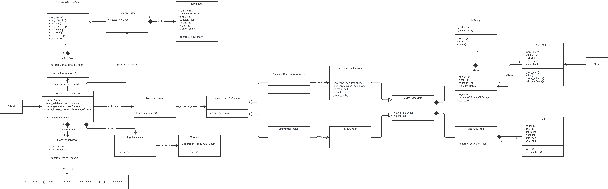
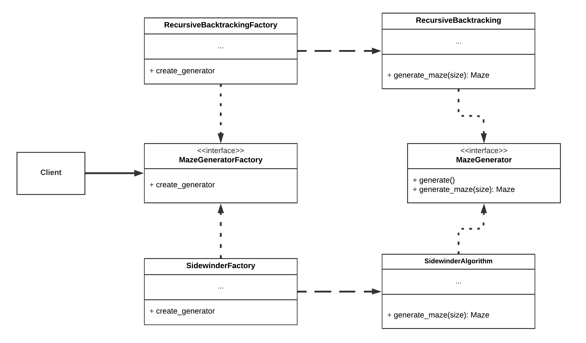
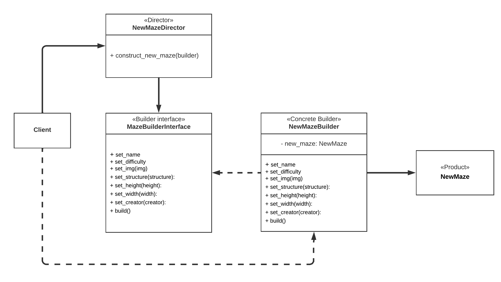
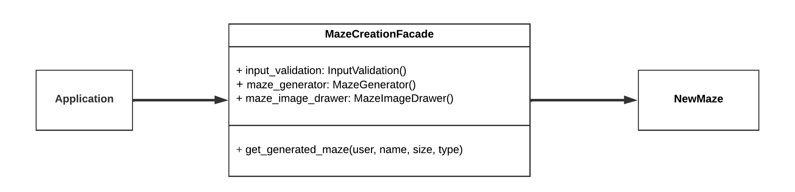
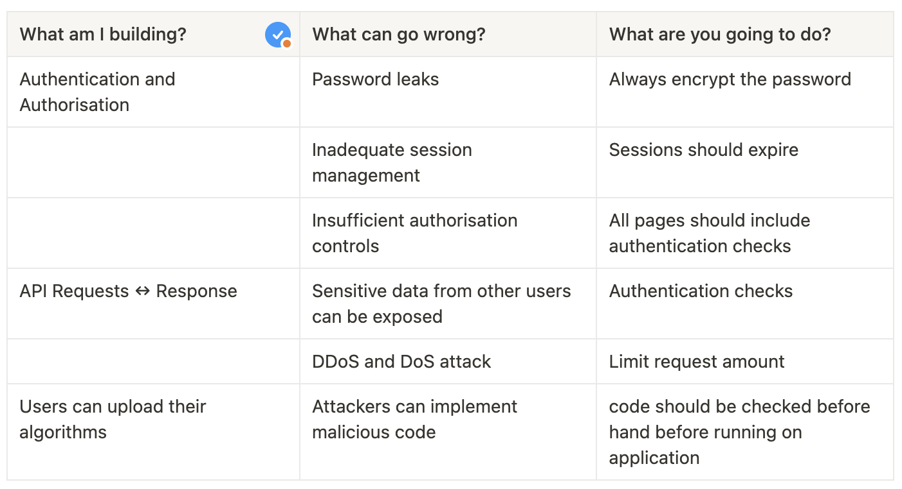
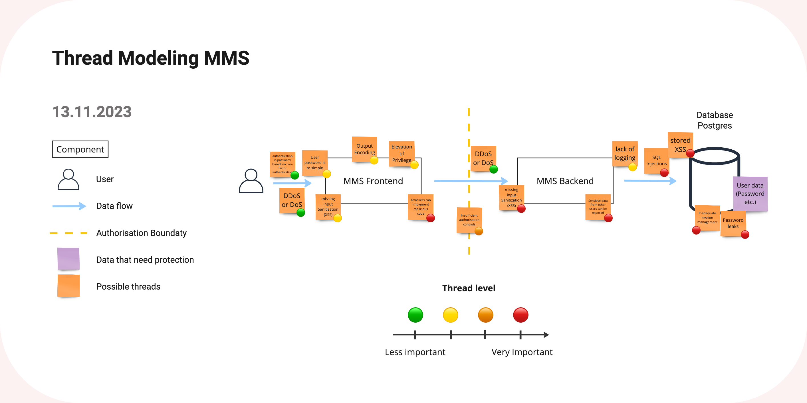

# Maze Runner Backend

#### Table of Contents

- [Documentation](#documentation)
  - [Overview](#overview)
  - [Diagrams](#diagram)
  - [Controllers](#controllers)
  - [Design Patterns](#design)
- [Getting Started](#started)
  - [Running with Docker (recommended)](#docker)
    - [Prerequisites](#prerequisitesdocker)
    - [Installation](#installation)
    - [Setting up the environment](#envdocker)
    - [Running the application](#rundocker)
  - [Running with Python](#python)
    - [Prerequisites](#prerequisitespython)
    - [Flask](#flask)
    - [Installation](#installationpython)
    - [Create database](#databasepython)
    - [Running the application](#runpython)
  - [Available Scripts](#scripts)
- [Security](#security)
  - [List of cyber security measures](#measures)
  - [Thread Models](#thread)
    - [List of Security Vulnerabilities and Weaknesses](#vulnerabilities)

---

# Documentation 

## Overview 

Here is the link to the hosted website of [Maze Runner](https://maze-runner-website.vercel.app/).

This is the backend for [Maze Runner Website](https://github.com/Lennartstachowiak/maze-runner-website).

- Maze Runner is a application on which users can compete against each other by creating algorithms to solve mazes.
- Each successful solution path from the start to the goal will be added to the highscore list.
- Users can generate new mazes which they own and can practice with.
- Algorithms can directly be created and edited in the application and can be tested while writing the code.
  - Errors will be shown as well.

The user authentication and authorisation is handled, the maze and user data is managed, the data is handled with the database, algorithms are executed and mazes are generated here.

### Tech Stack

- The backend is built with [Python](https://www.python.org/) and [Flask](https://flask.palletsprojects.com/en/3.0.x/).
- The database is [PostgreSQL](https://www.postgresql.org/) and it uses [SQLAlchamy](https://www.sqlalchemy.org/) as ORM and [Flask-Migrate](https://flask-migrate.readthedocs.io/en/latest/) to handle SQLAlchemy database migrations.

### Project Structure / Diagram 

#### Structure - C4 Diagram

|                     [Context Diagram](images/1_mms_overview.png)                      |                    [Container Diagram](images/2_application_overview.png)                    |
| :-----------------------------------------------------------------------------------: | :------------------------------------------------------------------------------------------: |
|         |  |
|                  [Component Diagram](images/3_backend_overview.png)                   |                       [Code Diagram](images/4_backend_controller.png)                        |
|  |      |

#### Maze Creation - UML Class Diagram

> 💡 Smaller Diagrams of each Design Pattern can be find [here](#design)

## Controllers 

> 💡 Orchestrating Application Flow and User Interactions

### User

These are controller which handle user related tasks.

- [Login Controller](app/controller/user/login_controller.py)
  - Allow users to sign in to application.
- [Register Controller](app/controller/user/register_user_controller.py)
  - Allow users to register to application.
- [Logout Controller](app/controller/user/logout_controller.py)
  - Allow users to log out of application.
- [Authentication Controller](app/controller/user/get_user_controller.py)
  - Authenticats user with session cookie.
- [Session Controller](app/controller/user/session_controller.py)
  - Creates a new session for a user with expiry date and deletes old sessions.

### Maze

These are controller which handle maze related tasks. From fetching mazes to generate new mazes and solving them.

- [Get Mazes Controller](app/controller/maze/get_mazes_controller.py)
  - Fetches all official mazes.
- [Get Single Maze Controller](app/controller/maze/get_single_maze_controller.py)
  - Fetches one specific maze.
  - This can be a user own maze or an official maze.
- [Get User Mazes Contoller](app/controller/maze/get_my_mazes_controller.py)
  - Fetches all mazes of the user.
- [Get Maze Solution Controller](app/controller/maze/get_maze_algorithm_solution_controller.py)
  - Handles to generate the solution for a maze and the given user algorithm.
- [Generate Maze Controller](app/controller/maze/generate_maze_controller.py)
  - Allows users to generate their own mazes.
- [Delete Maze Controller](app/controller/maze/delete_maze_controller.py)
  - Allows users to delete their own mazes.
- [Add Maze Highscore Controller](app/controller/maze/add_maze_highscore.py)
  - Adding the score achieved by users on mazes with their alogrithms.
- [Remove Maze Highscore Controller](app/controller/maze/remove_maze_highscore.py)
  - Removes user highscore if the user achieves a better score with another algorithm.

### Algorithm

These are controller which handle algorithm related tasks. A algorithm can be newly created or changes can be saved.

- [Get Algorithms Controller](app/controller/algorithm/get_algorithms_controller.py)
  - Fetches all users algorithms.
- [Get Single Algorithm Controller](app/controller/algorithm/get_single_algorithm_controller.py)
  - Fetches one specific algorithm of the user.
- [Add New Algorithm Controller](app/controller/algorithm/add_new_algorithm_controller.py)
  - Creates a new algorthm for the user.
- [Delete Algorithm Controller](app/controller/algorithm/delete_algorithm_controller.py)
  - Deletes a existing algorihm of the user.
- [Rename Algorithm Controller](app/controller/algorithm/rename_algorithm_controller.py)
  - Renames an user algorithm for the user.
- [Save Algorithm Controller](app/controller/algorithm/save_algorithm_controller.py)
  - Saves changes made to the algorithm.

## Design Patterns 

### Abstract Factory Method

I created a [MazeGeneratorFactory](app/models/maze/maze_generator_factory.py) and two Factories ([SidewinderFactory](app/models/maze/maze_generator_factory.py), [RecursiveBacktrackingFactory](app/models/maze/maze_generator_factory.py)).

The factories are used in the file [generate_maze.py](app/models/maze/generate_maze.py) in the class `MazeGenerator` (line 29).

### Builder

I created a [NewMazeBuilder](app/models/maze/generate_maze.py) and a [NewMazeDirector](app/models/maze/generate_maze.py) to build a [NewMaze](app/models/maze/generate_maze.py).

I created a simple [UserBuilder](app/models/user/register_user.py) which created the user at the registration.

### Facade

I created a [MazeCreationFacade](app/models/maze/generate_maze.py) which simplifies the usage of the underlying subsystems by providing a higher-level and more user-friendly interface to create a maze.

### Model-View-Controller (MVC)

I created a MVC architectural structure for the backend application.

- View = [Routes](app/routes)
- Controller = [Controllers](app/controller)
- Model = [Models](app/models)

---

# Getting Started 

You can run the programm locally in two different ways.

- Running with **Docker** (recommended)
- Running with **Python**

## Running with **Docker** (recommended) 

### Prerequisites 

- **Docker**
  - It is a platform that allows you to package, distribute, and run applications using containers.

#### Tested versions 

- **Docker** version 24.0.6, build ed223bc

  - Check with

        docker -v

- **Docker Compose** version v2.22.0-desktop.2

  - Check with:

        docker-compose -v

### Installation 

To use Docker with this project, you'll need to have Docker installed on your system. If you haven't installed Docker yet, follow these steps:

1.  Visit the Docker website: https://www.docker.com

2.  Download the installer for your operating system (e.g., Docker Desktop for Windows, Docker Desktop for macOS, Docker Engine for Linux).

3.  Run the installer and follow the on-screen instructions to complete the installation.

4.  Once the installation is complete, start the Docker application.

> 💡 For detailed installation instructions and system requirements, please refer to the official Docker documentation.

### Setting up the environment 

You need to create a `.env` file in the root directory and need to add some PostgreSQL data for the database:

    DATABASE_TYPE=postgres
    POSTGRES_USER=your_username
    POSTGRES_PASSWORD=your_password
    POSTGRES_DB=your_db_name

Furthermore you also need to add to `.env`

    SECRET_KEY=your_secret_key
    ALLOW_ORIGIN=http://localhost:3000

These keys will be used for encryption and to allow localhost requests.

### Running the application 

In root directory run:

    docker compose up

This command will set up everything for you automatically.

**Now you are ready to go!** 🚀

---

## Running with **Python** 

### Prerequisites 

- Python

### Installation 

- Python
  - Check out the official website of python (https://www.python.org/) to install python for your operating system.

### Flask 

#### In root directory (if `venv` already exist skip to step 2):

1.  Create a virtual enviorment (venv):

        python3 -m venv venv

2.  Start venv with:

        source venv/bin/activate

3.  Install packages for virtual enviorment:

        pip install -r requirements.txt

4.  For flask commands set flask with:

        export FLASK_APP=run

    > ⚠️ Needed if you encounter this error `Error: Failed to find Flask application or factory in module 'app'. Use 'app:name' to specify one.`

### Create database 

> 💡 We will use a `SQLite` locally with this approach. `PostgreSQL` will be used for docker.

#### Set up enviorment

You need to create a `.env` file in the root directory and need to add the database type:

    DATABASE_TYPE=sqlite
    SECRET_KEY=your_secret_key
    ALLOW_ORIGIN=http://localhost:3000

If you get an error by setting up the database, make sure to run:

    source .env

#### Set up database

Migration folder (`/migrations`) for the database structure should already exist.

If not, run this command:

-     flask db init
-     flask db migrate -m 'init'

To create the database locally use:

-     flask db upgrade

This will create a file called: database.db

#### Changing the database

If you want to modify the db you need to create a migration commit like this:

-     flask db migrate -m 'your changes'

#### Scripts to set up the database data

In the root directory run:

    python3 -m app.scripts.addDummyDataMazeDB

### Running the application 

    python3 run.py

**Now you are ready to go!** 🚀

---

## Available Scripts 

In the project directory you can run:

### **Add data**

#### Add dummy data highscores for each maze and user

    python3 -m app.scripts.addDummyDataHighscoresDB

#### Add all example algorithms for a user **(will be done by default already)**:

    python3 -m app.scripts.addDummyDataAlgorithmsDB user_id

#### Add all official mazes to db **(will be done by default already)**:

    python3 -m app.scripts.addDummyDataMazeDB

### **Delete data**

#### Delete all algorithms for all users:

    python3 -m app.scripts.deleteAlgorithms

#### Delete all mazes:

    python3 -m app.scripts.deleteMazes

#### Delete all highscores:

    python3 -m app.scripts.deleteHighscores

#### Delete all expired sessions:

    python3 -m app.scripts.deleteExpiredSessions

#### Delete all user session:

    python3 -m app.scripts.deleteSession user_id

---

# Security 

The following parts are security measures for the **backend application** here as well as for the [**frontend application**](https://github.com/Lennartstachowiak/maze-runner-website).

## List of cyber security measures 

- **CORS** Allow-Origin: Controls and restricts access to resources from different origins.
- **Request Origin** Header check at endpoints: Verifies the request's origin header to prevent unauthorized cross-origin requests.
- Cookie with **httponly** attribute: Prevents JavaScript access to the cookie, reducing the risk of session hijacking and unauthorized account access.
- Cookie with **secure** attribute: Ensures that the cookie is transmitted only over secure and encrypted HTTPS connections.
- Backend and frontend hosted on **HTTPS**: Both the backend and frontend are hosted using HTTPS for secure communication.
- Password is **hashed and salted**: Passwords are securely encrypted using a hash function and unique salts for increased security.
- Authentication: Users are required to create and **secure passwords**.

## Thread Models 

### List of Security Vulnerabilities and Weaknesses 

The following list is partly already included in the upper diagram. The diagram was created with help with the following bulletpoints:

- SQL Injections and stored XSS
- Lack of two-factor authentication for password-based authentication
- Insufficient input sanitization:
  - Failure to validate and restrict user input based on expected format (e.g., allowing only alphanumeric characters)
  - Pain points in my application:
    - Username and algorithm name inputs
    - Code in algorithms
- Insufficient output encoding:
  - Failure to encode user-generated content before displaying it in HTML or JavaScript contexts
- DDoS or DoS vulnerability
- Elevation of Privilege:
  - Possible to access other user mazes by manipulating the URL ID
- Lack of logging of the identity of the caller
